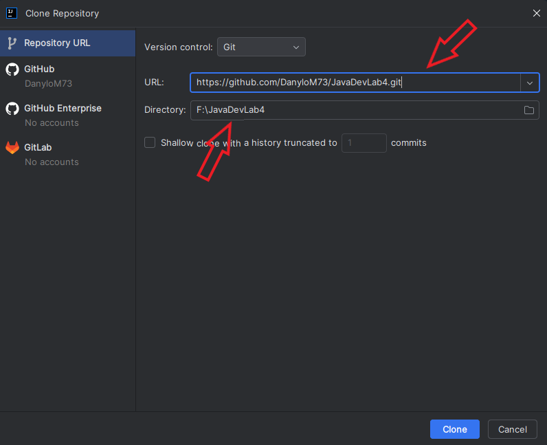
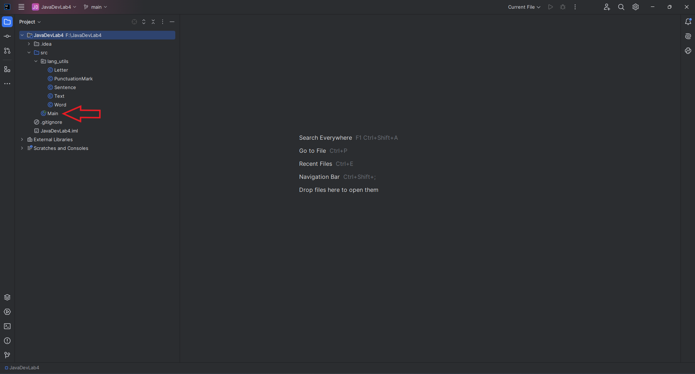
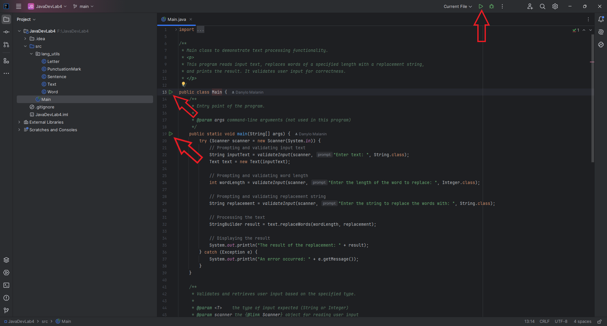
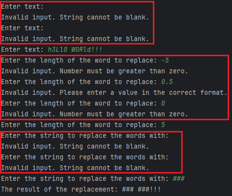

# Розробка програмного забезпечення на платформі Java

## Лабораторна робота №4

### Інструкція зі встановлення та першого запуску

_Застосунок було написано в Intellij IDEA, тому тут буде надана інструкція з інсталювання додатка саме через цю IDE._

1. **Клонувати цей репозиторій на свою локальну машину.**

У початковому вікні Intellij IDEA треба натиснути кнопку `Get from VCS`.

У наступному вікні потрібно вказати посилання на цей репозиторій та шлях до директорії, у якій цей репозиторій буде клоновано.

2. **Запустити додаток.**

Треба відкрити файл `Main.java`.

Тоді стануть доступними кнопки для запуску додатка.

При натисканні кнопки запуску зліва від коду в діалоговому вікні потрібно вибрати перший пункт.

### Інформація щодо роботи додатка

Додаток може валідувати вхідні дані, наприклад, початковий текст та текст для заміни не можуть бути пустими, або складатися лише з пробілів, а число, що відповідає за довжину слова, що має бути заміненим, має обов'язково бути цілочисельним та більшим за 0.

Також, як можемо бачити, словами вважаються сполучення букв та цифр, всі інші символи ігноруються та залишаються без змін.